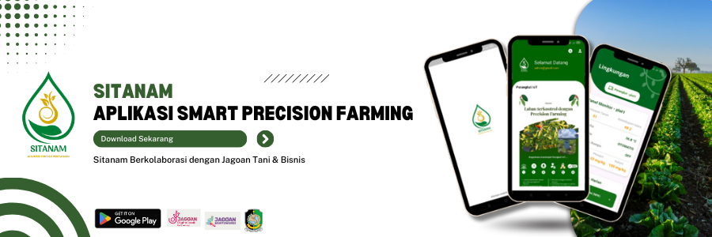
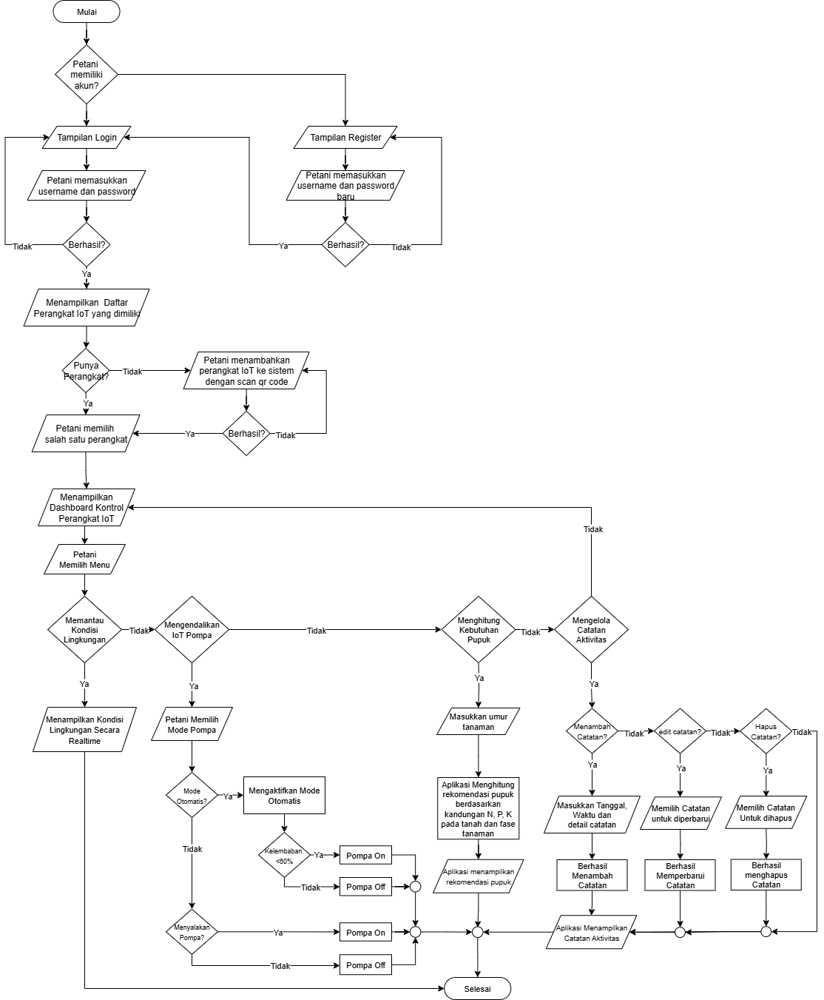
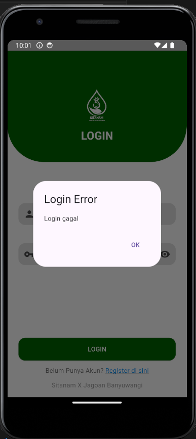
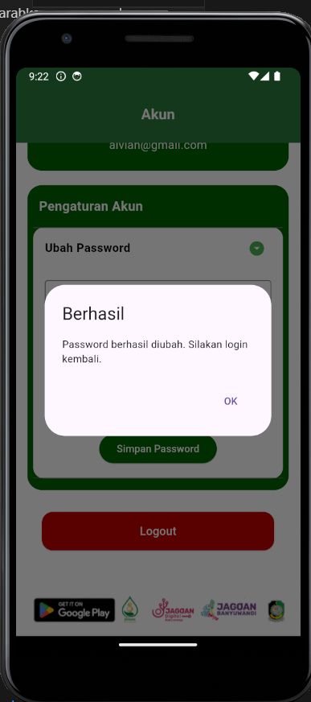
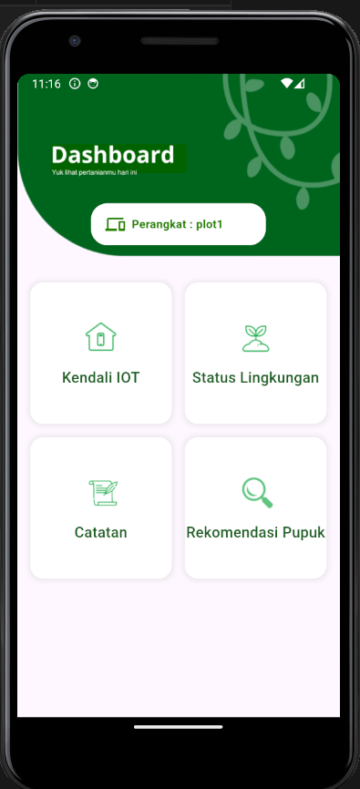
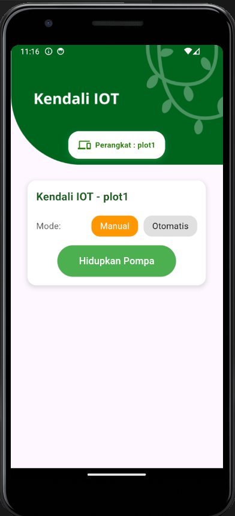
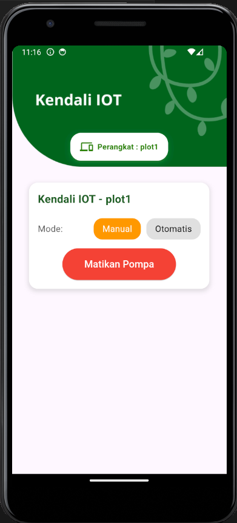
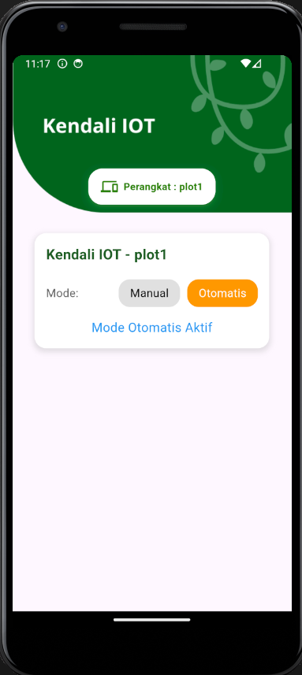

# Sitanam – Aplikasi Smart Precision Farming System

**Sitanam** adalah aplikasi mobile berbasis Smart Precision Farming yang dirancang untuk membantu petani dalam mengelola lahan pertanian secara modern, efisien, dan berkelanjutan. Aplikasi ini terintegrasi dengan perangkat IoT (Internet of Things) berbasis ESP32 dan berbagai sensor (kelembaban tanah, suhu, kelembaban udara, NPK, pH, dsb.), sehingga mampu memantau kondisi lahan secara real-time, mengontrol alat dan melihat rekomendasi pupuk yang sesuai dengan tanaman menggunakan sistem pengambilan keputusan presisi.

## Ketentuan Teknis
Pengembangan Aplikasi ini menggunakan framework **Flutter** dan berikut adalah ketentuan teknis untuk menjalankan aplikasi

| Teknologi | Versi     |
|-----------|-----------|
| Flutter   | 3.22.2      |
| Dart      | 3.4.3    | 

**Penting!** diharpakan saat menjalankan versi flutter anda sesuai dengan ketentuan teknis diatas agar tidak ada perubahan warna tampilan dan lainya.

## Alur Penggunaan Aplikasi
Alur aplikasi sitanam dapat dilihat pada flowchart dibawah ini

## Dokumentasi Pengerjaan

### Seluruh Dokumentasi Pengerjaan Per fitur dan halaman aplikasi akan dijelaskan dibawah ini !

**Pembuatan Splash Screen**

Saat aplikasi dijalankan, pertama kali muncul Splash Screen berupa logo dan nama sistem selama 5 detik. Layar ini memberi kesan awal sekaligus waktu inisialisasi, lalu otomatis mengarahkan pengguna ke halaman login.

**Pembuatan Halaman Login & Register**

Halaman Login digunakan untuk masuk dengan email dan password melalui Firebase Authentication. Jika benar, pengguna masuk ke Halaman Daftar Perangkat IoT, jika salah muncul pesan error.
Halaman Register digunakan untuk membuat akun baru dengan email, password, dan konfirmasi password, lalu didaftarkan ke Firebase Authentication.

| Halaman Login | Halaman Register | Error Handling (berhasil login)| Error Handling (gagal login)|
|----------|----------|----------|--------|
|  |  |  | |

**Pembuatan Halaman Daftar Perangkat IoT**

Halaman Daftar Perangkat IoT menampilkan perangkat yang terhubung secara real-time dari Firebase Realtime Database. Setelah login, pengguna diarahkan ke halaman ini: jika belum ada perangkat, ditampilkan panduan menambah perangkat; jika ada, ditampilkan daftar perangkat dalam bentuk card untuk dikontrol.
Pengguna dapat menambah perangkat lewat ikon +, menghapus perangkat dengan tekan lama pada card, serta mengatur akun lewat ikon profil di pojok kanan atas..

| Daftar Perangkat IoT (jika masih belum memiliki perangkat) | Daftar Perangkat IoT (telah menambahkan perangkat ke aplikasi)  | Error Handling (jika menghapus perangkat)|
|----------|----------|----------|
|  |  |  |

**Pembuatan Halaman Tambah Perangkat IoT**

Halaman ini memudahkan pengguna menghubungkan perangkat IoT ke akun dengan memindai kode QR. Sistem akan memverifikasi ID di Firebase, lalu menambahkan UID pengguna ke data perangkat. Jika berhasil, muncul popup konfirmasi.

| View Scan QR menambahkan perangkat IoT | Error Handling (jika berhasil menambahkan perangkat) |
|----------|----------|
|  |  |

**Pembuatan Halaman Kelola Akun**

Halaman ini menampilkan email akun aktif, menyediakan fitur ganti password (dengan memasukkan password lama, baru, dan konfirmasi), serta tombol logout untuk keluar dari akun.

| Halaman Kelola Akun | Halaman Kelola Akun (kolom isi) | Error Handling |
|----------|----------|-------------|
|  |  |   |

**Pembuatan Halaman Dashboard Kontrol Perangkat IoT**

Setelah memilih perangkat yng ingin dikontrol, pengguna diarahkan ke Dashboard sebagai pusat navigasi IoT. Dashboard ini sederhana dan menampilkan menu menuju fitur utama seperti Kendali IoT, Status Lingkungan, Catatan, dan Rekomendasi Pupuk, sehingga memudahkan pemantauan dan pengendalian sesuai kebutuhan.

| Halaman Dashboard Kontrol Perangkat IoT | 
|----------|
|  |

**Pembuatan Halaman Kendali IoT**

Halaman Kendali IoT memungkinkan pengguna mengatur pompa dari jarak jauh. Tersedia dua mode: Manual, dengan tombol hidupkan/matikan pompa, dan Otomatis, di mana sistem mengendalikan pompa sesuai logika yang telah ditentukan. Tampilan dibuat sederhana agar pengguna mudah berpindah antar mode sesuai kebutuhan di lapangan.

| Mode Manual Pompa On| Mode Manual Pompa Off | Mode Otomatis sesuai kelembaban tanah |
|----------|----------|-------------|
|  |  |   |

-------------------

This project is a starting point for a Flutter application.

A few resources to get you started if this is your first Flutter project:

- [Lab: Write your first Flutter app](https://docs.flutter.dev/get-started/codelab)
- [Cookbook: Useful Flutter samples](https://docs.flutter.dev/cookbook)

For help getting started with Flutter development, view the
[online documentation](https://docs.flutter.dev/), which offers tutorials,
samples, guidance on mobile development, and a full API reference.
